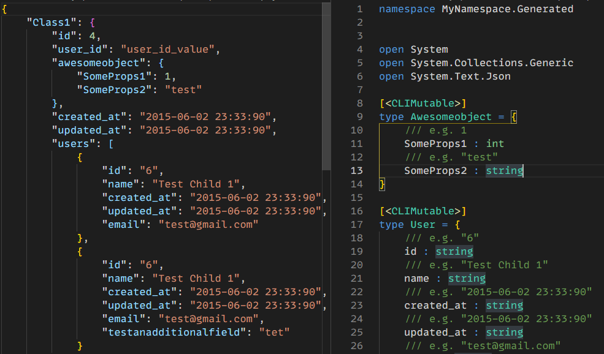

# Json to F# Generator tool

F# implementation of [Json2CSharpCodeGenerator](https://github.com/Json2CSharp/Json2CSharpCodeGenerator)

example usage (more options with --help):

`dotnet tool install --global json2fsharp`

`json2fsharp .\samples\sample.json .\samples\output.fs -n MyNamespace.Generated`

example output:

